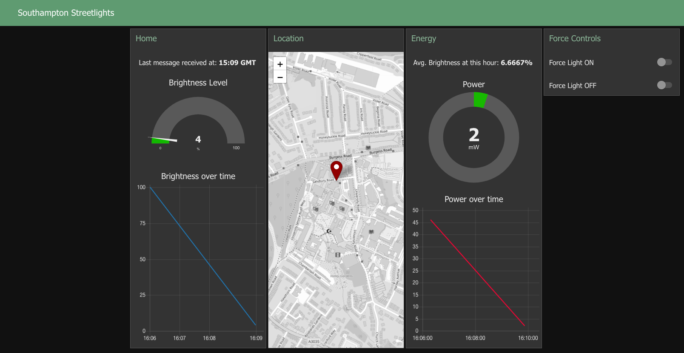

 <h1>Smart Street Lighting  🏙️ </h1> 

    
    

### Intro
This project is a proof of concept. It shows how LoRaWAN can be
used to for remote monitoring and control of street lights.
I designed a street light that:
- Adjusts its brightness depending on ambient light
- Sends its current brightness and power draw over LoRa
- This is communicated to my application running on The Things Network
- My node-RED GUI interfaces with the application using MQTT

### Circuit Parts
- Arduino MKRWAN 1300 
- LED
- BH1750 light sensor

### Deployment
- Power up circuit and upload *light-sensor.ino* to the arduino
- `$ node-red`
- Go to *localhost:1880*
- Import *flow.json* into the canvas
- Go to dashboard and view test deployment

### Dashboard

    

